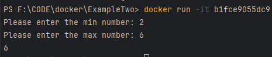

# Get familarity with Docker interactive mode

### Reference Documentation
This  is a python program to demonstrate interactive shell where we can STDIN

`docker build .`
after building it, if i try to run it `docker run image_id` we will get an error

`docker run img_id` in this cmd we are attached interactively with terminal by default( we can see the output but not enter anything)
FIX: 
    -i, --interactive                      Keep STDIN open even if not attached
    -t, --tty                              Allocate a pseudo-TTY(Atached terminal through which we can enter STDIN)

Hence `docker run -it img_id`

Now docker container successfully ran and exited. However we can start it again `docker start container_id` 
and it starts it in detached mode only but with options we can start in attached/interactive mode .

FIX: `docker start -ia container_id`

## Stoping,Deleting Containers and Images

    `docker rm con_id1,con_id2,...`   to remove multiple containers
    `docker rmi img_id1, img_id2,...` to remove multiple images

* Remove container automatically on stopping it 
    Example my springboot app
    `docker run -p 8081:8080 -d -rm image_id` 
    `docker stop container_id ` Once the container is stopped, container will be automatically removed

## Naming Containers and Images
* Containers
    `docker run -p 8081:8080 -d -rm -name my_sb_app image_id`
    `docker stop my_sb_app`
* Images
    With `docker build .` we get the below looking images

    
    Images names are called tags which consists of two parts: repository and tag
    name:tag e.g. my_sb_app:v1
    Now `docker build -t my_sb_app:v1 .`

    

## Sharing an image

    1. Sharing Dockerfile
    2. Sharing prebuilt images

* Sharing prebuilt images (dockerhub, etc...)
    create an account in docker hub
    login to docker hub
    You can push a new image to this repository using the CLI:

    `docker tag local-image:tagname new-repo:tagname`
    `docker push new-repo:tagname`
    

    `docker push image_name`
    `docker pull image_name`
    `docker push athermalla/my_sb_app`

