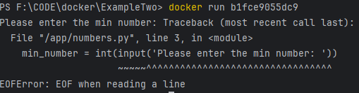

# Get familarity with Docker interactive mode

### Reference Documentation
This  is a python program to demonstrate interactive shell where we can STDIN

`docker build .`
after building it, if i try to run it `docker run image_id` we will get an error

`docker run img_id` in this cmd we are attached interactively with terminal by default( we can see the output but not enter anything)
FIX: 
    -i, --interactive                      Keep STDIN open even if not attached
    -t, --tty                              Allocate a pseudo-TTY(Atached terminal through which we can enter STDIN)

Hence `docker run -it img_id`

Now docker container successfully ran and exited. However we can start it again `docker start container_id` 
and it starts it in detached mode only but with options we can start in attached/interactive mode .

FIX: `docker start -ia container_id`

